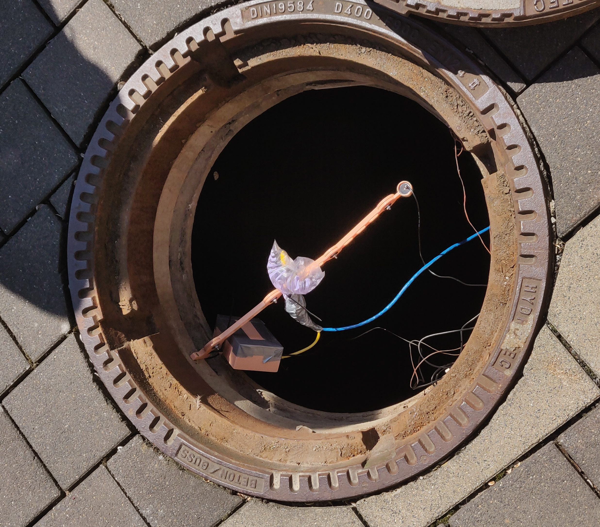
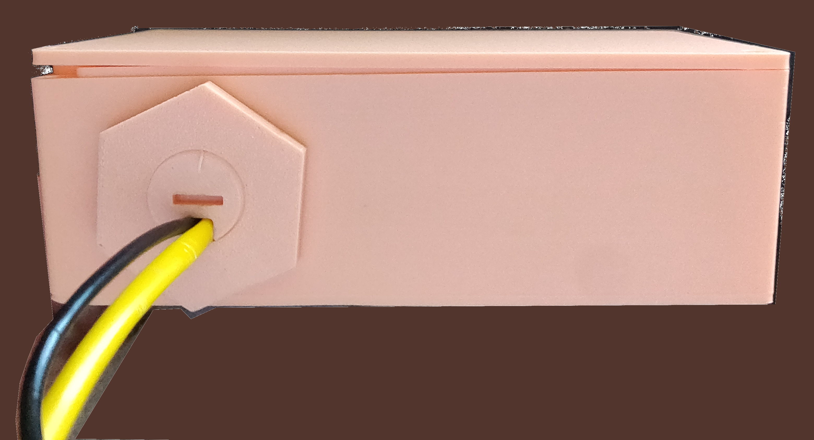
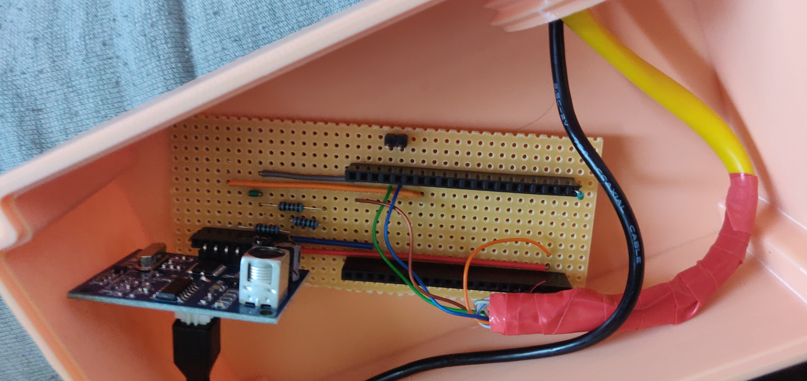

# Cistern Water Level Sensor with ESP32 + Home Assistant

This project monitors the water level in a rainwater cistern using two ESP32s, some ultrasonic wizardry, and Home Assistant. One ESP32 lives in the cistern (moist and miserable), the other chills in the house and communicates via serial over a good ol’ CAT cable. The indoor unit connects to Home Assistant through ESPHome.

## 💡 How it works

- **ESP32 (Tank Unit):**  
  Sits in the cistern and measures the distance to the water surface using a waterproof ultrasonic sensor (JSN-SR04T).  
  Listens for a `"MEASURE"` command via UART and replies with the distance in meters.

- **ESP32 (House Unit):**  
  Lives indoors, connected to Home Assistant via ESPHome.  
  Periodically sends a `"MEASURE"` command over serial to the tank ESP32, waits for a response, and publishes the distance as a sensor in Home Assistant.

## ❓ Why Two ESP32s?

The cistern is too far from the house (and WiFi). Instead of fighting with flaky wireless through meters of dirt, stone, and disappointment, we split the job:

- The **Tank ESP32** handles just the sensor and sends raw data via UART.
- The **House ESP32** sits indoors with proper WiFi and talks to Home Assistant via ESPHome.

They're connected using a standard CAT5/6 cable, which carries serial data reliably over distance — no need to mess with WiFi repeaters, underground cabling, or black magic. Just good old serial comms, like it's 1999.

## 📎 CAT Cable Pinout

If you're using a standard CAT5/6 cable to connect the two ESP32s via UART, here's how the wires are used:

| Color  | Function     |
|--------|--------------|
| Green  | UART RX/TX   |
| Blue   | UART TX/RX   |
| Brown  | GND          |
| Orange | 5V Power     |

## 🧰 Stuff you'll need

- 2× ESP32 boards  
- 1× Ultrasonic distance sensor (used an AJ-SR04M)  
- CAT5/6 cable for serial comms  
- Power supply

## 🖼️ Images

| Mounted Sensor | Tank Unit Box | Tank Unit Circuit |
|----------------|----------------|--------------------|
|  |  |  |

> _Actual DIY chaos. No renderings, just real wires and hope._
